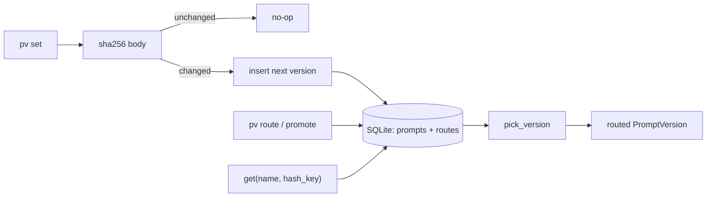

# prompt-versioner — Git-style version control for production prompts

[](https://github.com/darrshangovender/prompt-versioner/actions/workflows/tests.yml)
[](LICENSE)
[](https://python.org)
[](https://sqlite.org)

> Prompts as a managed artifact rather than a string literal. Versioned in a single SQLite file, diffable, rollback-able in one command, with hash-stable weighted routing so you can put a new version in front of 10% of traffic and watch the evals before going to 100%.

**Why this exists.** Prompts in production behave exactly like code — they have versions, they have bugs, they get rolled back at 2am. But most teams keep them as Python string literals, which means no diff, no rollback, and no A/B without a redeploy. This makes prompts as managed as any other production artifact, without forcing them into your source tree or into a vendor's console.

Pairs with [prompt-eval-toolkit](https://github.com/darrshangovender/prompt-eval-toolkit), which decides whether a version deserves promotion.

---

## Quick start

```bash
pip install -e ".[dev]"
```

```bash
pv set extractor < extractor_v1.txt     # first version → v1, auto-routed to 100%
pv set extractor < extractor_v2.txt     # changed text → v2
pv diff extractor 1 2                   # unified diff
pv route extractor --split 1:0.9,2:0.1  # 10% of traffic to v2
pv promote extractor 2                  # go to 100%
pv promote extractor 1                  # instant rollback
pv history extractor                    # every version, with timestamps
```

```python
from prompt_versioner import PromptStore

ps = PromptStore("prompts.db")

# hash_key is what the split is computed over — pass the thing that should
# stay on one version. Omit it and every call resolves to the SAME version.
pv = ps.get("extractor", hash_key=request.user_id)

prompt = pv.body.format(text=input_text)
log.info("prompt_version", name=pv.name, version=pv.version, sha=pv.sha256)
```

## How it works



1. `pv set` reads the body from stdin and strips it.
2. The SHA-256 is compared against the latest version — an identical body is a no-op, so re-running a deploy script doesn't inflate the version log.
3. A changed body is inserted as the next integer version. The first version of a prompt is auto-routed to 100%.
4. `route` validates that every named version exists before persisting the weights as JSON; `promote` is sugar for `{v: 1.0}`.
5. At call time `get(name, hash_key)` loads the weights and hands them to `pick_version`.
6. `pick_version` takes `sha256(hash_key)[:8]`, maps it to a fraction in `[0, 1)`, and walks the cumulative partition over versions in sorted order.

## The CLI

| Command | What it does |
|---|---|
| `pv list` | Every prompt and its current route |
| `pv set <name>` | Read stdin, save as the next version |
| `pv get <name> [version] [--hash-key K]` | Print a body — a specific version, or the routed one |
| `pv diff <name> <v1> <v2>` | Unified diff between two versions |
| `pv route <name> --split 1:0.9,2:0.1` | Set the weighted route |
| `pv promote <name> <version>` | Shorthand for `--split version:1.0` |
| `pv history <name>` | All versions with timestamps and hashes |

## Design decisions

| Decision | Why |
|---|---|
| **Hash-stable routing, not random** | Random A/B means the same user hits v1 then v2 on consecutive turns — confusing UX and noisy evals. Hashing a stable key pins each subject to one version for the life of a routing config. |
| **SHA-256 idempotency on `set`** | Deploy scripts re-run. Without the hash check, every deploy would append a duplicate version and make the history useless. |
| **Routes in a separate table from bodies** | Bodies are immutable once written; routes change constantly. Splitting them means a rollback is a single-row update and never touches prompt history. |
| **SQLite** | One file, zero infra, works in a hobby project and at production-medium scale. The `PromptStore` surface is deliberately tiny so a Postgres adapter is a small, obvious piece of work. |
| **Rich for the CLI, nothing else at runtime** | The library half has no dependency that a production service would object to. |

## Limitations

- **`get()` defaults `hash_key` to the prompt name.** That hashes a constant, so the same version comes back on every call, forever. Traffic splitting only works if the caller passes `hash_key=` explicitly — a user id, session id, or request id. This is the single sharpest edge in the library.
- **No usage telemetry.** Nothing records which version served which call. To answer "did v2 actually do better", you have to log `pv.version` yourself at the call site and join it against your own metrics.
- **The SQLite connection is shared with `check_same_thread=False` and no lock, no WAL, no busy timeout.** Concurrent writers will hit `database is locked`, and `set()`'s read-latest-then-insert is a non-atomic race that can collide on `UNIQUE(name, version)`. It is safe for a single writer and many readers; it is not safe for a multi-worker web server writing prompts.
- **Weights are never validated to sum to 1.** `route` checks only that the versions exist; `pick_version` silently renormalises. `--split 1:0.9,2:0.9` is accepted and quietly becomes 50/50.
- **Repartitioning is not minimal.** `pick_version` walks versions in sorted order, so changing the weight of a low-numbered version shifts every boundary above it — considerably more traffic migrates than the size of the weight change.
- **Nothing prunes.** Every changed `set()` appends a row and no retention policy exists. `list_prompts()` is also an N+1 query — one history read plus one weights read per prompt name.
- **`pv get <name> 0` silently falls through to the route** because the CLI tests the version for truthiness rather than for `None`. Version numbers start at 1, so this only bites if you type a zero.

## Project layout

```
prompt-versioner/
├── prompt_versioner/
│   ├── store.py       # PromptStore — set · get · route · promote · history
│   ├── routing.py     # pick_version: hash-stable weighted picker
│   ├── diff.py        # unified diff between two bodies
│   └── cli.py         # pv set/get/diff/route/promote/list/history
└── tests/             # 6 tests, no API keys
```

Two tables, and that is the whole schema:

```sql
CREATE TABLE prompts (
    id INTEGER PRIMARY KEY AUTOINCREMENT,
    name TEXT NOT NULL, version INTEGER NOT NULL,
    body TEXT NOT NULL, sha256 TEXT NOT NULL, created TEXT NOT NULL,
    UNIQUE(name, version)
);
CREATE TABLE routes (name TEXT PRIMARY KEY, weights TEXT NOT NULL, updated TEXT NOT NULL);
```

## Tests

```bash
pytest tests/ -q       # 6 tests, fully offline
```

Coverage is thin and honestly reported: the store round-trip and the routing partition (including a statistical balance check on a 50/50 split). CI runs the suite on every push.

## Author

Darrshan Govender · [Agulhas Code](https://agulhascode.co.za) · Durban, South Africa
